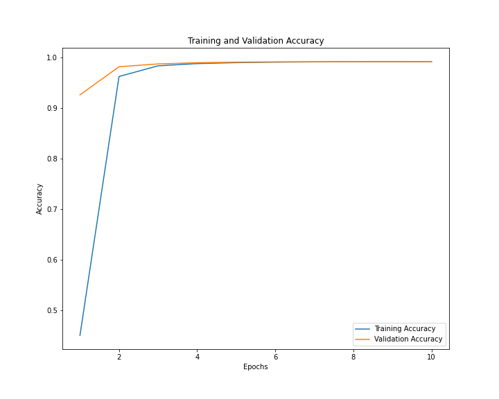
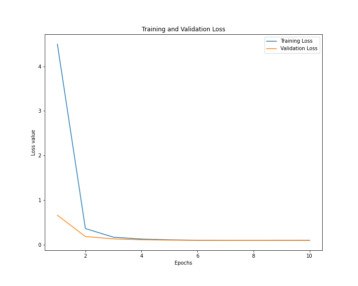

## Prerequisites.
To run the project please install the dependencies via the pip command. Most of the code will require a [Google Cloud 
Platform provisioned TPU](https://cloud.google.com/tpu/docs/managing-tpus-tpu-vm#tpu-nodes). However, the code can be 
modified to run on a CPU or GPU as model checkpoints are available as the model has converged.
```
pip install -r requirements.txt
```

I ran the code in a compute instance with size <b>n1-standard-2</b> and <b>TPU v2-8 Node</b> as the accelerator.

For re-generating vocabulary please refer the [data preprocessing notebook](CS_421_Dataset_preprocessing_and_Vocab_generation.ipynb).
The model training and testing happens in [main.py](main.py)

## Project Hypothesis
This project attempts to test the hypothesis that given a piece of code (a function) can the high-level documentation 
(docstrings) be estimated accurately. To test the hypothesis the docstrings are in natural language whereas the code 
is in Python Programming Language.

## Dataset used
The dataset used in testing the hypothesis is freely available on [Github](https://github.com/github/CodeSearchNet). It 
is present in the form of jsonl files.


## Methodologies used
Given the nature of the problem we are supposed to translate programming language to natural language. In the domain of 
natural language processing this is a problem of translating a sequence into another sequence. 
This problem has been tackled with the family of Seq2Seq models.

These models have an encoder and a decoder component. The encoder component takes in the input embeddings of the 
instance of data and the decoder component takes in the output or target embeddings of the instance of data. Throughout 
the training, the model is fed the actual target labels into the decoder component. This approach is called as Teacher 
Forcing. 

Now, our problem is slightly different from most use-cases of Seq2Seq models/translation. The language Python although 
is popular amongst developers, but it is not at all popular when it comes to the commonly available text copra. Since, 
pretrained word embeddings models such as Word2Vec or Glove are not available for our use case. We either need to train 
such a model before approaching the hypothesis or try something else which is more robust than word2vec models.

### 1. Enter WordPiece Algorithm
WordPiece algorithm is a sub-word tokenization algorithm which breaks down vocabulary of given text copra into smaller 
units called as sub-words. This helps on problems such as making the model more robust to <b>OOVs or Out of 
Vocabulary Tokens</b>, which is something we may observe a lot when it comes to trying to tokenize 
variables/functions/classes names also called as programming symbols. This tokenization technique strikes a balance 
between a character-level tokenizer and word-level tokenizer.

### 2. Model
We choose a Transformer model for the code summarization task. The reasons behind this are that Transformer Model is 
more robust for long-range dependencies in text which is something we can expect in code. For example, a list is declared 
before the start of a big for in loop, and then the other variables are appended to that list at then end of the loop. 

Given that our dataset is fairly large with 457,461 entries, we would benefit from a model which can train by consuming 
entire sentences (or functions) instead of processing each token sequentially like in the case of RNNs and LSTMs.

### 3. Model Summary and Metrics Used
Below is the summary of the model used to test the hypothesis.

```
Model: "transformer_model"
_________________________________________________________________
 Layer (type)                Output Shape              Param #   
=================================================================
 encoder (Encoder)           multiple                  11079680  
                                                                 
 decoder (Decoder)           multiple                  13184512  
                                                                 
 dense_4 (Dense)             multiple                  8481000   
                                                                 
=================================================================
Total params: 32,745,192
Trainable params: 32,745,192
Non-trainable params: 0
_________________________________________________________________
```
During training of the model we monitor the following metrics training accuracy, training loss, validation accuracy 
and validation loss. And finally we calculate the accuracy and loss on the test set. Selecting a baseline for the model 
proved to be quite difficult as I had trained the model on the subset of the entire dataset which included 5 
more programming languages.

## Results




```
Test accuracy 0.9917734265327454
Test loss 0.09996318072080612
```

## References
<a id="1" herf="https://github.com/github/CodeSearchNet">[1]</a>
Husain, Hamel, Ho-Hsiang Wu, Tiferet Gazit, Miltiadis Allamanis, and Marc Brockschmidt. "Codesearchnet challenge: 
Evaluating the state of semantic code search." arXiv preprint arXiv:1909.09436 (2019).